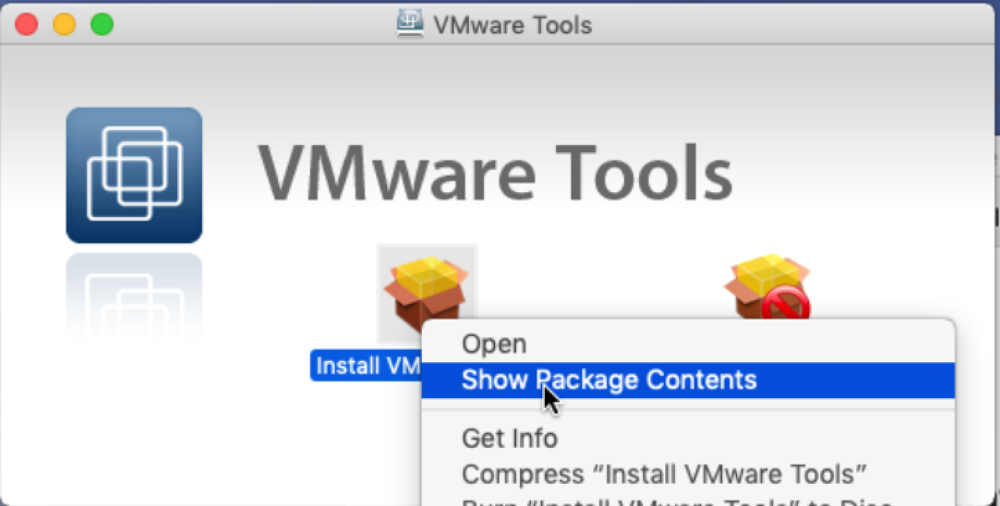
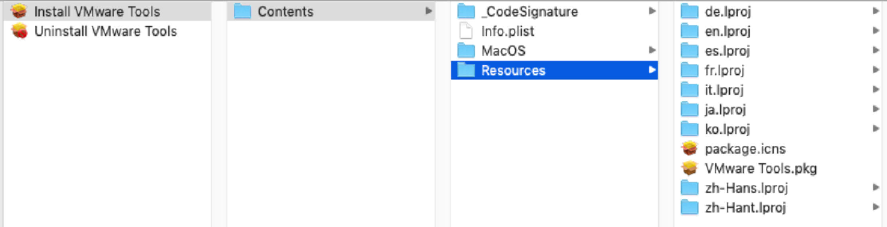

# Re-enroll macOS Device into Jamf Pro Auto-Magically after Performing an Erase Install of macOS 10.13.4+

___
This set of scripts allows you to integrate a re-enrollment workflow with (macOSUpgrade by Josh Roskos)[https://github.com/kc9wwh/macOSUpgrade] also with many other contributing.

**Currently a forked version is available here while the pull request is reviewed. [forked macOSUpgrade](https://github.com/cubandave/macOSUpgrade2/tree/installPackage).**

 <b>Example Image for Self Service. Find more in the "images" Folder</b> 
  

## Key Objectives of These Scripts

This tool was built with three major objectives in mind: 

* Enable IT Support to flip devices quickly
* Enable Jamf Admins to test quickly
* Simplify the gotchas of testing with DEP activated devices across instances

## Story behind it (just for fun)

In my environment I've been dreaming about a day when imaging is dead, when it is *easy as pie* for our Service Desk to repurpose the device, and then do it while fully supporting the new "Configuration" workflows everyone is incorporating with tools like [SplashBuddy](https://github.com/Shufflepuck/SplashBuddy) or [DEPNotify](https://gitlab.com/Mactroll/DEPNotify).

There are many times when I'd like to restore Macs, physical or virtual, and set them up in a new Jamf environment. And yes you __can__ use snapshots with VMs and even `tmutil` on IRL APFS-Formatted Macs. Read this [great blog post](https://www.modtitan.com/2018/12/how-to-do-quick-testing-with-irl-macs.html) by [@emily/smashism](https://github.com/smashism). 

But let's face it...

* **I Forgot!!!!** (ノಠ益ಠ)ノ彡┻━┻ #tableFlip
* Or don't have enough space for all my snapshots. ﴾͡๏̯͡๏﴿ O'RLY?
* **Oh snap!** This device is assigned to a different MDM in Apple Business/School Manager. ಠ_ಠ
* My time got filled up with meetings and I couldn't get my testing done in 24 hours. (_`tmutil` limitation on IRL Macs_) 

### ┻━┻ ︵ヽ(\`Д´)ﾉ︵ ┻━┻   #doubleTableFlip

**These scripts are my solution to all of that.**

## Key Features

The tool can be configured multiple ways. But here's a short break down of the main features.

* Enroll a macOS device without QuickAdd PKGs
* Allows for enrollments with a static enrollment invitation
  * **OR** Securely **create** and **automatically expiring unique** computer enrollment invitations per device, all with Jamf Pro Classic API
* Check across up to *4* Jamf Pro Instances to determine if the device assigned to a different MDM Server 
* Can ask the person running the policy about multiple naming options:\*
  * Keep the current same name of the computer.
  * Pre-name the computer to something different (like Bob) or
  * Assign no name at all.
  
  \* This process also allows you, as the Jamf Admin, to set any of these as the default behavior

# How does it work?

1. Creates a package with with `pkgutil` 
  * Package creates two *LaunchDaemons* and one *LaunchAgent* (_each one will be explained below_) 
  * Package installs two scripts to `/usr/local/libexc/AutoEnroll` (_each one will be explained below_) 
2. In the `autoenroll.sh` script an invitation code is inserted when the script is written that the computer will utilize to enroll the computer without credentials
  * **(for greater security)** Using the `create-computer-invitation.sh` you can create unique invitation codes that expire after 2 days.
  * This will also can create a management account based on your settings (_more details below_) 
3. This package is passed back to the `macosupgrade.sh` and added as a `--installpackage` which makes a copy into the newly created `Mac OS Install Data Volume`
4. After the OS Erase and Install is complete the package from step 1 plops the scripts down and writes the LaunchDaemons (yes, I did this the hard way...20/20 hindsight, but it works great!)
5. The computer looks for the Jamf server and then enrolls the Mac
  * **(If the Device is DEP assigned this step is skipped)**
6. Once a user account is created and they login a LaunchAgent checks for UAMDM ◕‿◕
7. Then if a computer name was assigned/kept this is applied with `jamf setComputerName -name "Bob"`
8. If you enable the `splashbuddy` option with the `macOSUpgrade.sh` script then it will write the files:
  * \~/Library/Containers/io.fti.SplashBuddy/Data/computerName.txt 
  * \*/Library/Containers/io.fti.SplashBuddy/Data/Library/.SplashBuddyFormDone 

# How to set it up

## Requirements
* You need [macOSUpgrade by Josh Roskos](https://github.com/kc9wwh/macOSUpgrade)
  * if the pull request hasn't made it in yet, you can use this [forked script](https://github.com/cubandave/macOSUpgrade2/tree/installPackage)
* `make-re-enroll-PKG-for-macos.sh` from this repo under scripts
* Create a policy with `make-re-enroll-PKG-for-macos.sh` and fill it out with paramter4`target_jssURL` & parameter5/`invitationCode`.
* Create a policy, scoped to all, with only a custom event `testClient` with `touch /private/var/client/receipts/clientresult.txt` in the execute command area. This allows the script to test if the enrollment was successful.

**To enable DEP checking and unique invitation codes, keep reading.**

**I believe in you!!!!**

## For Unique Computer Invitation Code Generation
If you want to create unique codes for enrollment, because your IT Security is as paranoid as the CIA, then you'll need the following...

* Upload `create-computer-invitation.sh` from this repo under scripts
* Create a Policy with a custom event name 
* A user account on Jamf Pro with create privileges to **Computer Enrollment Invitations**
* Encrypt the username and password in with a Salt & K [Encrypted-Script-Parameters](https://github.com/jamf/Encrypted-Script-Parameters)
* Hard-code the Salt & K into `create-computer-invitation.sh` on the Jamf Pro Server
* Modify the policy with the `create-computer-invitation.sh` script
  * Put the **encrypted** user name in **parameter5**/`jss_user_encrypted`
  * Put the **encrypted** password in **parameter6**/`jss_pass_encrypted`
* Add the custom event name for the new policy into the policy with `make-re-enroll-PKG-for-macos.sh` in **parameter6**/`jamfPolicy2CreateInvitation`
  * **Don't forget to blank out parameter5/`invitationCode`**

### Note: Randomizing Jamf Management Account Password
If you do not provide a static `mgmtpassword_encrypted` then the script will set the Jamf management account to the result of `openssl rand -hex 12` (a random hex password with 12 characters. Typically made up of numbers, uppercase, and lowercase letters)

**You can always have a policy later change the management account password, even on Enrollment Complete.** 

## For DEP Checking
If you want to have the workflow check if the device is assigned to DEP on the Jamf Pro instances you have then you'll need to do the following.

* The same user account on each Jamf Pro server to check with **read privileges** to **"Device Enrollment Program"**
* Encrypt the username and Password in with a Salt & K [Encrypted-Script-Parameters](https://github.com/jamf/Encrypted-Script-Parameters)
* Hard-code the Salt & K into `make-re-enroll-PKG-for-macos.sh` on the Jamf Pro Server
* Modify the policy with the `make-re-enroll-PKG-for-macos.sh` script
  * Put the **encrypted** user name in **parameter7**/`DEPcheckUserName_encrypted`
  * Put the **encrypted** password in **parameter8**/`DEPcheckUserPass_encrypted`

## IMPORTANT NOTE ABOUT ENTRYPTING USERNAME & PASSWORDS
Please go check out [Encrypted-Script-Parameters](https://github.com/jamf/Encrypted-Script-Parameters) for information on how to encrypt the user name and passwords used for the **API Username and Password** and for the **Jamf management account**

## Script Parameter Descriptions and Recommended Labels
Adding parameter labels will make things easier for you:

### For `make-re-enroll-PKG-for-macos.sh`
* **parameter4**=`jssURLs (target;otherjss2check;...)`
  * _Required_
  * This is the URL for the Jamf Pro server you want the device to enroll to. 
  * If you want the script to also check other Jamf Pro servers you can add `;` and more URLs
  * **Jamf Pro policy parameters only support up to 256 characters**
  * **Do not add a trailing slash**
* **parameter5**=`invitationCode or Event Name`
  * _Required_ - You have 2 options
  1. Set this to the Custom Event Name for the policy to create an invitation.
    * Use this to run a policy with the `create-computer-invitation.sh`  
    * Set this parameter to the custom event name of that policy  
    * **Make sure the target_jssURL match in both policies**
  2. Put a static enrollment invitation ID. You can make on the jamf Pro server by going to 
    * Computers > Enrollment invitations> + New
    * Insert any email info
    * Check `Allow multiple uses`
    * Set a long expiration (and a calendar reminder to make a new one) ◕‿↼
    * Click `Save` then `Done`
    * Open the new invitation
    * Copy the `INVITATION ID`
* **parameter6**=`DEPcheckUserName_encrypted`
  * _Optional_
  * Add an encrypted string of the DEP Checker username here
  * This will read each Jamf Server to find out if the device has been assigned to an MDM server for Automated Enrollment.
* **parameter7**=`DEPcheckUserPass_encrypted`
  * _Optional_, unless you have `DEPcheckUserName_encrypted` set 
  * Add an encrypted string of the DEP Checker password here
* **parameter8**=`--/ask/keepname/prename (splashbuddy)`
  * _Optional_
  * Use this to control the way that re-enrollment to your jamf Pro server is done
  * NOTE: To Default to assigning no computer after the wipe put nothing in here
  * (ask) - Use jamfHelper to ask the user what to do with the computer name 
  * (keepname) - Default to automatically preserve computer name 
  * (prename) - Default to automatically asking for a new computer name 
  * (splashbuddy) - Add this to the parameter setting to automatically create a ComputerName.txt and .SplashBuddyFormDone 
  * **Do not add a trailing slash**
* **parameter9**=`macOSUpgradePolicyEventName`
  * _Optional_
  * Use this to triger the macOS upgrade.
  * This script, (macOSUpgrade by Josh Roskos)[https://github.com/kc9wwh/macOSUpgrade] will have suppport for setting `installpackage` as a variable.
  * **Currently I have a forked version available here while the pull request is reviewed. [forked macOSUpgrade](https://github.com/cubandave/macOSUpgrade).**
  * **You must use the `productbuild.pkg` in order for the macOS installer to work.
  * **Pro tip** by running the policy once without a macOS upgrae script you'll get the path of the the PKG
  `/tmp/enroll-macos-to-jamf-pro/compiled/enroll-macos-to-jamf-pro-1.0-productbuild.pkg`

### For `create-computer-invitation.sh`
* **parameter4**=`target_jssURL`
  * This is the URL for the Jamf Pro server you want the device to enroll to. 
  * **Do not add a trailing slash**
* **parameter5**=`jss_user_encrypted`
  * _Required_
  * This is the encrypted string for the Enrollment Invitation username that creates the code.
* **parameter6**=`jss_pass_encrypted`
  * _Required_
* **parameter7**=`mgmt_username_encrypted`
  * _Optional_
  * This is the encrypted string for the Enrollment Invitation password that creates the code.
  * **Needs to be encrypted with the same Salt & K used for the API credentials**
* **parameter8**=`create_account_if_does_not_exist`
  * _Required_
  * Must be `true` or `false`
* **parameter9**=`hide_account`
  * _Required_
  * Must be `true` or `false`
* **parameter10**=`lock_down_ssh`
  * _Required_
  * Must be `true` or `false`
* **parameter11**=`mgmtpassword_encrypted (optional)`
  * _Optional_
  * This is an encrypted string for the managment account password
  * **Needs to be encrypted with the same Salt & K used for the API credentials**

## Pro-tip: How to Automate VMware Tools Install
* Upload a copy of `VMware Tools.pkg` to you Jamf Pro server
  * You can pull it by Show Package Contents 
  * Found in Under **Contents > Resources**

 <b>Extracting VMware Tools.pkg</b> 
   
  

  
* Make a Smart Computer Group
  * Optical Drive > is > `NECVMWar VMware SATA CD01` \*
* Create a on enrollment policy to install the package scoped to the group you made earlier
* You and enable the Kexts and Drag and Drop features with the profiles available in the [config-profiles folder](./config-profiles/).
* **One or two restarts will be required after the KEXT is enabled.**

 \* Might be slightly different depending on your software

# Inspirations
Lots of ideas came from the following sources.
[autoenroll by jamf](https://github.com/jamf/autoenroll)

# Credits
* Ayla for emotional support and some, ok... lots of grammar/spell checking (^̮^)
* My grammar king and rock Christoph
